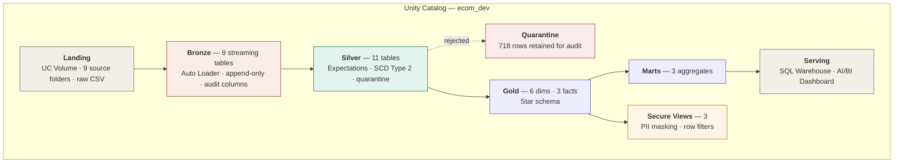
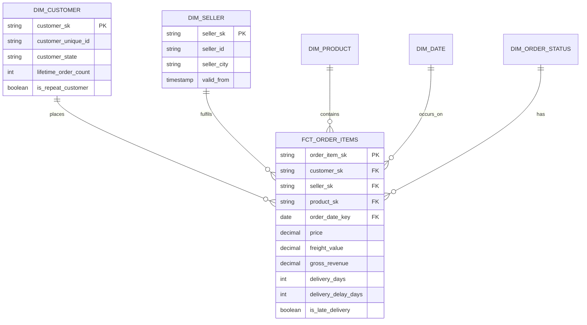
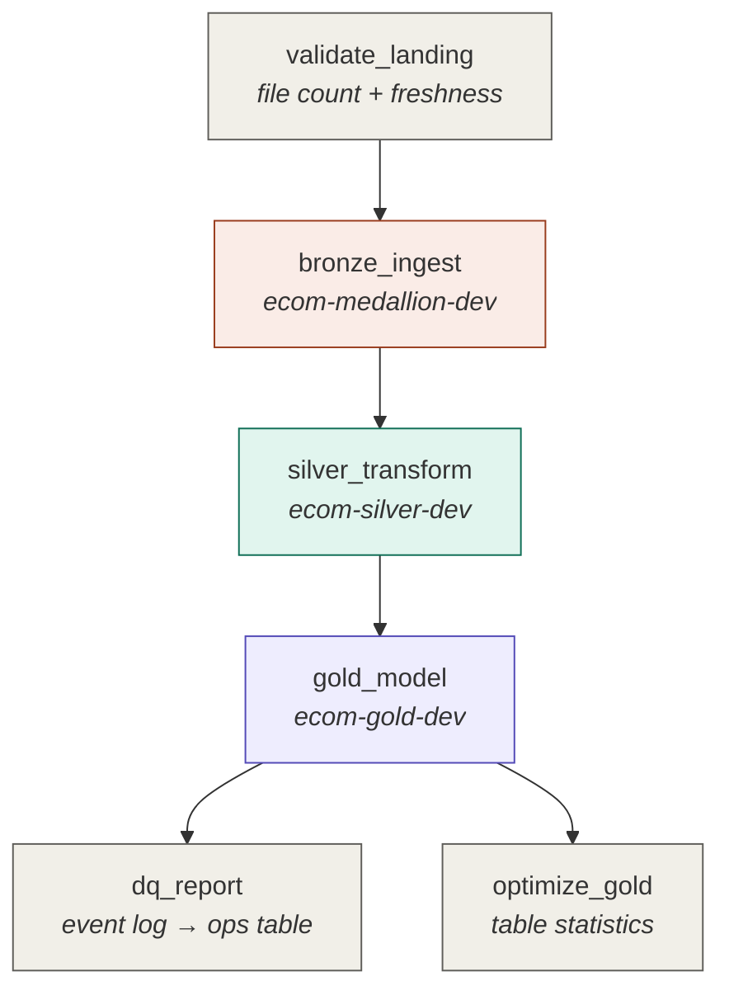

# E-Commerce Order-to-Insight Lakehouse

**An end-to-end medallion architecture on Databricks — from raw CSV drops to a governed star schema and executive dashboard.**

Processing 1.55M source records across 9 systems into a dimensional model with enforced data quality, slowly-changing-dimension history, PII governance, and orchestrated CI/CD.


---

## Table of Contents

- [The Problem](#the-problem)
- [Key Findings](#key-findings)
- [Architecture](#architecture)
- [Data Model](#data-model)
- [Workflow & Orchestration](#workflow--orchestration)
- [Data Quality Strategy](#data-quality-strategy)
- [Governance](#governance)
- [Results](#results)
- [Design Decisions](#design-decisions)
- [Running This Yourself](#running-this-yourself)
- [Repository Structure](#repository-structure)
- [Limitations](#limitations--what-id-do-differently-at-scale)

---

## The Problem

### Business context

Olist is a Brazilian marketplace that connects small independent sellers to major e-commerce platforms. A customer buys on a partner storefront; Olist routes the order to one or more sellers, coordinates logistics, and collects a post-delivery review.

That model generates data across five operational systems — order management, seller catalogue, payment processing, logistics, and customer feedback — which land daily as flat file exports. There is no single source of truth.

### What was broken

Leadership could not reliably answer four questions:

1. **What is monthly GMV, average order value, and repeat-purchase rate?**
2. **Which sellers and regions drive late deliveries?**
3. **Does delivery delay actually cause bad reviews — and by how much?**
4. **How did product categorisation change over time, and does that invalidate historical reporting?**

Analysts answered these with ad-hoc spreadsheet joins against raw exports. The consequences were structural, not cosmetic:

| Failure | Consequence |
|---|---|
| No conformed dimensions | Two teams reported different GMV for the same month |
| Source records overwritten in place | No history — a seller's previous city was unrecoverable |
| No quality enforcement | Malformed timestamps and orphan records flowed silently into reports |
| PII copied into shared files | Customer identifiers and geolocation freely accessible |
| Full-file reprocessing | Every refresh reread the entire history |

### The requirement

Build a lakehouse that:

- **Ingests incrementally** — process only what is new, tolerate schema drift
- **Enforces quality at every layer** — with rejected rows auditable, not silently dropped
- **Preserves history** — dimension attributes change; reporting must survive that
- **Exposes a certified star schema** — one definition of GMV, one definition of a customer
- **Restricts PII by role** — masked columns, filtered rows, classified metadata
- **Deploys reproducibly** — infrastructure as code, tested, with automated lineage

### Dataset

[Brazilian E-Commerce Public Dataset by Olist](https://www.kaggle.com/datasets/olistbr/brazilian-ecommerce) (CC BY-NC-SA 4.0) — ~100k real orders, September 2016 to October 2018, across 9 related tables.

Chosen because it presents the genuinely hard problems rather than a clean tutorial dataset: multi-source integration, real quality defects, slowly-changing dimensions, late-arriving facts, and PII that justifies actual governance.

---

## Key Findings

> ### Late delivery costs 1.72 review stars
>
> Orders delivered after the estimated date average **2.57 stars**, against **4.29** for on-time deliveries. The effect is graded — review scores decline steadily as lateness increases, from 4.3 for early deliveries down to 1.8 for the worst cases.
>
> With 6.4% of order lines arriving late, delivery reliability is the highest-leverage operational improvement available.

> ### The repeat-purchase rate is 3.1%, not 0%
>
> The source `customer_id` is regenerated for every order. Only `customer_unique_id` identifies a person. Modelling on the order-level key — as most analyses of this dataset do — returns 99,441 "customers" and a 0% repeat rate, hiding **2,997 returning customers**.

> ### Revenue is geographically concentrated
>
> São Paulo alone accounts for **R$ 5.9M of R$ 15.8M** total GMV. Delivery performance in the São Paulo corridor disproportionately determines company-wide satisfaction.

---

## Architecture


*Lineage graph generated automatically by Unity Catalog — traced from actual data flow, not hand-drawn.*



### Layer contracts

Each layer has an explicit contract. Stating them is what makes this a medallion architecture rather than three schemas with colour-coded names.

| | Bronze | Silver | Gold |
|---|---|---|---|
| **Purpose** | Preserve source truth | Make it correct | Make it useful |
| **May drop rows?** | Never | Only on null business key | Never |
| **May cast types?** | No | Yes | Yes |
| **May join?** | No | Only to conform | Yes |
| **On schema drift** | Rescue into `_rescued_data` | Fail loudly | Fail loudly |
| **Idempotent?** | Yes — Auto Loader checkpoints | Yes — AUTO CDC | Yes — full recompute |
| **Consumer** | Silver only | Gold + engineers | Analysts + dashboards |

**The rule that matters: bronze never loses a row.** If the exact bytes the source sent cannot be reconstructed, the pipeline is not auditable — and auditability is the reason the layer exists.

### Technology

| Component | Service | Role |
|---|---|---|
| Ingestion | **Auto Loader** | Incremental file discovery, schema inference and evolution |
| Transformation | **Lakeflow Declarative Pipelines** | Declarative ETL with quality expectations |
| CDC | **`dlt.apply_changes`** | SCD Type 2 dimension history |
| Storage | **Delta Lake** | ACID, time travel, change data feed |
| Governance | **Unity Catalog** | Namespace, lineage, masking, row filters, tags |
| Orchestration | **Lakeflow Jobs** | 6-task DAG with parallel branch, retries |
| Serving | **Databricks SQL** | Serverless warehouse and AI/BI dashboard |
| Deployment | **Asset Bundles + GitHub Actions** | Infrastructure as code, CI |

---

## Data Model

### Star schema



### Object inventory

**Bronze — 9 streaming tables.** `br_orders` · `br_order_items` · `br_customers` · `br_sellers` · `br_products` · `br_payments` · `br_reviews` · `br_geolocation` · `br_category_translation`

Every row carries `_ingested_at`, `_source_file`, `_source_system`, `_rescued_data`.

**Silver — 11 tables.**

| Table | Rows | Key transformation |
|---|---:|---|
| `sv_orders` | 99,441 | Typed timestamps, normalised status, 6 expectations |
| `sv_order_items` | 112,650 | Typed decimals, composite surrogate key |
| `sv_payments` | 103,886 | Suspect payments flagged, not dropped |
| `sv_reviews` | 99,224 | Retained at true grain — see design note |
| `sv_customer_keys` | 99,441 | Bridge: order key → person key |
| `sv_customers` | 96,096 | Person-level, deterministic dedup |
| `sv_geolocation` | 19,015 | 1M rows collapsed to one centroid per ZIP |
| `sv_sellers_history` | 3,135 | **SCD Type 2** — 40 sellers with 2 versions |
| `sv_products_history` | 33,011 | **SCD Type 2** — 60 products with 2 versions |
| `sv_category_translation` | 71 | Reference lookup |
| `sv_quarantine_orders` | 718 | Date-logic violations, retained for audit |

**Gold — 6 dimensions, 3 facts, 3 marts, 3 secure views.**

| Fact | Grain | Rows |
|---|---|---:|
| `fct_order_items` | order_id + order_item_id | 112,650 |
| `fct_payments` | order_id + payment_sequential | 103,886 |
| `fct_reviews` | review_id + order_id | 99,224 |

Full column-level detail in [`docs/data_dictionary.md`](docs/data_dictionary.md).

---

## Workflow & Orchestration




**Design points:**

- **`validate_landing` is a gate, not a formality.** It counts CSVs recursively and raises if any source directory is empty — failing before compute is spent on a broken input.
- **`dq_report` and `optimize_gold` run in parallel.** Both depend only on `gold_model`, so they execute concurrently rather than in sequence.
- **One pipeline per layer.** Silver can be re-run without reprocessing a million geolocation rows in bronze. Smaller blast radius, independent refresh cadence.
- **Triggered, not continuous.** Cost control. The same code runs in continuous mode by changing one setting.

**Runtime: 5m 15s end to end.** Retries: 2 with exponential backoff. Notification on failure.

### Proven incrementality

The dataset was deliberately split into two batches. Batch 1 loads history through June 2018; batch 2 adds the following quarter plus **40 relocated sellers** and **60 recategorised products**.


On the batch-2 run, `sv_customer_keys` processed **13,000 new rows** against an existing 86,617 — Auto Loader checkpointing meant no reprocessing of prior files.

### SCD Type 2 in action


The 40 relocated sellers each produce two rows: the original with `__END_AT` populated, the new record current with `__END_AT` NULL. Historical orders continue to resolve to the seller's city *at the time of the order*.

---

## Data Quality Strategy

14 expectations across three severity levels. Severity is chosen per rule, based on what the violation actually means.

| Rule | Table | Severity | Failures | Rationale |
|---|---|---|---:|---|
| `valid_order_id` | orders | **drop** | 0 | Row is unusable without a business key |
| `valid_customer_id` | orders | **drop** | 0 | Same |
| `known_status` | orders | **drop** | 0 | Unknown status implies upstream corruption |
| `carrier_after_approval` | orders | warn | 1,359 | Timestamp inconsistency — the revenue is still real |
| `delivered_has_date` | orders | warn | 8 | Status/date mismatch worth measuring, not discarding |
| `delivery_after_purchase` | orders | warn | 0 | Guard against impossible sequences |
| `positive_value` | payments | warn | 9 | Zero-value payments are real voucher-covered orders |
| `known_payment_type` | payments | warn | 3 | `not_defined` retained and flagged |
| `non_negative_price` | order_items | warn | 0 | Guard |
| `score_in_range` | reviews | warn | 0 | Guard |


**Rejected rows are quarantined, not deleted.** `sv_quarantine_orders` holds 718 records with impossible date sequences, each tagged with a reason. Those orders still flow into `sv_orders` — a carrier scan logged before an approval timestamp is a *timestamp* problem, not an invalid order, and dropping it would distort GMV.

Results are persisted to `ecom_dev.ops.dq_expectation_report` by the orchestration job, making quality a queryable time series rather than a transient UI panel.

---

## Governance


### PII masking

Three masking functions in `ecom_dev.security`:

| Function | Effect for non-privileged users |
|---|---|
| `mask_customer_id` | `abcd***REDACTED***` — first 4 characters only |
| `mask_coordinate` | Rounded to 1 decimal place (~11km precision) |
| `mask_free_text` | `[REDACTED]` — review comments suppressed |

Applied through secure views over the gold tables:

- **`v_dim_customer_secure`** — masked identifiers and coordinates
- **`v_fct_reviews_secure`** — free-text content excluded
- **`v_dim_customer_regional`** — row-level filtering by state

### Classification

Tags applied at table and column level: `data_classification` (PII / confidential / internal), `domain`, `certified`, `grain`. Column-level `pii` and `pii_type` tags mark identifiers and location data.

### Lineage

Unity Catalog traces every table from the landing volume through to the dashboard automatically. The lineage graphs in this README are generated, not drawn — they reflect actual data flow.

---

## Results

| Metric | Value |
|---|---|
| Source records ingested | **1,550,922** |
| Data quality expectations enforced | **14** across 3 severity levels |
| Rows quarantined for audit | **718** |
| Total GMV (reconciled to source) | **R$ 15,843,553.24** |
| Orders / line items | 98,666 / 112,650 |
| Customers (person-level) | 96,096 |
| Repeat customers | 2,997 (3.1%) |
| Average order value | R$ 160.58 |
| On-time delivery rate | 93.6% |
| Average delivery time | 12.0 days |
| SCD Type 2 versions tracked | 40 sellers, 60 products |
| Orphan dimension keys | **0** |
| End-to-end job runtime | 5m 15s |

**GMV reconciling to the cent against the source is the strongest correctness signal in the project.** Row counts can be right while money is wrong; matching totals mean no fanout, no dropped rows, and no double-counting anywhere in the chain.

---

## Design Decisions

### `review_id` is not the grain — and deduplicating on it would have been a bug

Profiling flagged 743 apparently duplicate `review_id` values. The obvious response is to deduplicate.

Investigating instead: all 724 affected IDs mapped to **two distinct orders each**, with identical scores and identical timestamps. That is not corruption — it is one customer reviewing a basket that was split across multiple sellers.

At the true grain of `review_id + order_id` there are **zero** duplicates. Deduplicating on the apparent key would have silently destroyed 743 valid order-review relationships and understated review coverage across the gold layer.

### `dim_customer` is keyed on the person, not the order

The source `customers` table has 99,441 rows but only 96,096 distinct `customer_unique_id` values, because `customer_id` is regenerated per order. Keying the dimension on `customer_id` produces a 0% repeat-purchase rate — technically consistent, factually wrong.

`bridge_customer_order` translates between the two so facts can carry the order-level key while the dimension stays at person grain.

### SCD Type 2 only where attributes actually change

Applied to sellers and products, which have genuine attribute changes. **Not** applied to customers, where new records are new people rather than changed ones — SCD2 there would produce a history table in which every row is version 1 and `__END_AT` is always NULL.

Deliberately not applying a pattern is itself a design decision.

### `is_late_delivery` is three-valued

TRUE for late, FALSE for on-time, **NULL for undelivered**. Coalescing NULL to FALSE would count every in-transit order as on-time and inflate the delivery metric. Analysis filters `WHERE is_late_delivery IS NOT NULL` explicitly.

### Suspect payments are flagged, not dropped

Three `not_defined` payment types and nine zero-value payments are marked `is_suspect` and retained. A zero-value payment typically means a fully voucher-covered order — a real business event. Dropping them would understate order counts.

Full write-ups in [`docs/adr/`](docs/adr/).

---

## Running This Yourself

### Prerequisites

- Databricks workspace (Free Edition is sufficient)
- [Olist dataset](https://www.kaggle.com/datasets/olistbr/brazilian-ecommerce) from Kaggle
- GitHub account

### Setup

**1. Create the namespace**

```sql
CREATE CATALOG IF NOT EXISTS ecom_dev;
USE CATALOG ecom_dev;

CREATE SCHEMA IF NOT EXISTS landing;
CREATE SCHEMA IF NOT EXISTS bronze;
CREATE SCHEMA IF NOT EXISTS silver;
CREATE SCHEMA IF NOT EXISTS gold;
CREATE SCHEMA IF NOT EXISTS security;
CREATE SCHEMA IF NOT EXISTS ops;

CREATE VOLUME IF NOT EXISTS landing.raw_files;
```

**2. Upload the data** into `/Volumes/ecom_dev/landing/raw_files/<source>/`, one directory per source: `orders`, `order_items`, `customers`, `sellers`, `products`, `payments`, `reviews`, `geolocation`, `category_translation`.

**3. Create three pipelines**

| Pipeline | Default schema | Source |
|---|---|---|
| `ecom-medallion-dev` | `bronze` | `src/bronze/` |
| `ecom-silver-dev` | `silver` | `src/silver/` |
| `ecom-gold-dev` | `gold` | `src/gold/` |

All serverless, all triggered mode. **Set catalog and schema at creation time** — a pipeline cannot be repointed afterwards.

**4. Run in order:** bronze → silver → gold.

**5. Apply governance** — run `setup/02_governance.sql`.

**6. Deploy with Asset Bundles** (optional)

```bash
databricks bundle validate -t dev
databricks bundle deploy -t dev
```

### Verification

```sql
SELECT ROUND(SUM(gross_revenue), 2) AS gmv, COUNT(*) AS line_items
FROM ecom_dev.gold.fct_order_items;
-- Expect: 15843553.24 | 112650

SELECT COUNT(*) FROM ecom_dev.gold.dim_customer;
-- Expect: 96096  (NOT 99441 — that indicates the wrong key)

SELECT COUNT(*) FROM ecom_dev.silver.sv_sellers_history WHERE __END_AT IS NULL;
-- Expect: 3095 current of 3135 total versions
```

---

## Repository Structure

```
├── src/
│   ├── bronze/ingest_autoloader.py       # Auto Loader, 9 sources
│   ├── silver/
│   │   ├── 01_reference.py               # Materialized views
│   │   ├── 02_facts.py                   # Streaming tables + quarantine
│   │   ├── 03_customers.py               # Bridge + person dimension
│   │   └── 04_scd2_dimensions.py         # apply_changes SCD2
│   ├── gold/
│   │   ├── 01_dim_static.py              # Date, order status
│   │   ├── 02_dim_seller.py              # SCD2 current version
│   │   ├── 03_dim_product.py             # SCD2 + translation
│   │   ├── 04_dim_customer.py            # Person grain + bridge
│   │   ├── 05_fct_order_items.py         # Central fact
│   │   ├── 06_fct_payments_reviews.py    # Payment and review facts
│   │   └── 07_marts.py                   # Business aggregates
│   └── ops/
│       ├── 01_validate_landing.py        # Pre-ingestion gate
│       ├── 02_dq_report.py               # Event log → ops table
│       └── 03_optimize_gold.py           # Table statistics
├── setup/                                 # Catalog, schema, governance DDL
├── sql/analytics_queries.sql              # The four business questions
├── resources/                             # Asset Bundle pipeline + job defs
├── tests/unit/                            # Transformation logic tests
├── docs/
│   ├── data_dictionary.md
│   ├── data_quality_rules.md
│   └── adr/                               # Architecture Decision Records
├── images/                                # Screenshots and lineage graphs
├── databricks.yml                         # Bundle root
└── .github/workflows/ci.yml               # Lint, test, validate
```

---

## Limitations & What I'd Do Differently at Scale

**Physical optimization is constrained by the declarative model.** Gold tables are pipeline-managed materialized views, so `OPTIMIZE` and `ALTER TABLE CLUSTER BY` cannot be applied externally — the same constraint blocks table-level masks and column comments. This is one architectural property, not three defects: declarative pipelines own their outputs, and layout, security, and metadata must be declared at definition time. In production I would declare clustering in the pipeline definition and validate layout through table statistics.

**Masking uses secure views rather than table-level policies.** Column masks on materialized views must be defined at creation, and refresh runs with the pipeline owner's identity — which on a single-user workspace means no visible masking. Production would use catalog-level ABAC policies bound to governed tags.

**Batch, not streaming.** Pipelines run in triggered mode to control cost. The same code runs continuously by changing one setting; latency would drop from hours to seconds at proportionally higher compute cost.

**City normalisation is rule-based.** It handles suffix and separator variants (`sao paulo sp`, `sao paulo - sp`, `maua/sao paulo`) but not typos such as `sao paulop`. Production would use fuzzy matching against a reference gazetteer.

**Single environment.** Dev and prod targets are defined in the bundle, but only dev is deployed — the workspace tier provides one environment.

**Geolocation centroids are approximate.** ZIP prefixes map to averaged coordinates, and 269 customers plus 7 sellers have no geolocation match at all. Their rows are retained with `has_geo = false` rather than dropped.

---

## Dataset & Licence

Brazilian E-Commerce Public Dataset by Olist — [Kaggle](https://www.kaggle.com/datasets/olistbr/brazilian-ecommerce), licensed CC BY-NC-SA 4.0. The dataset is not redistributed in this repository.

Project code is MIT licensed.
